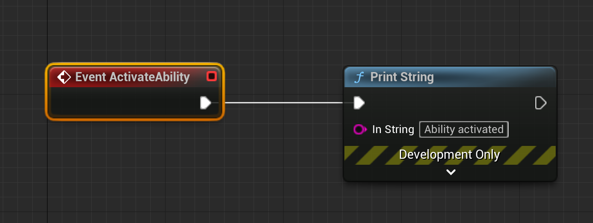
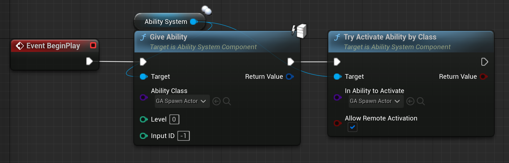
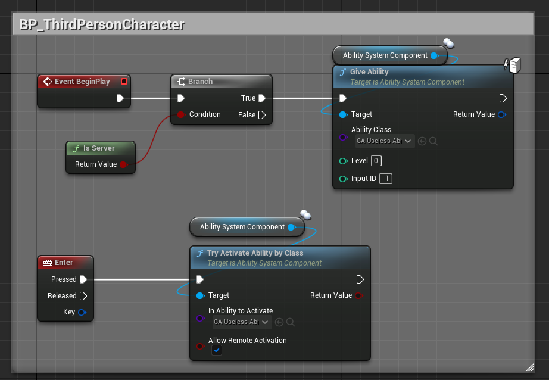
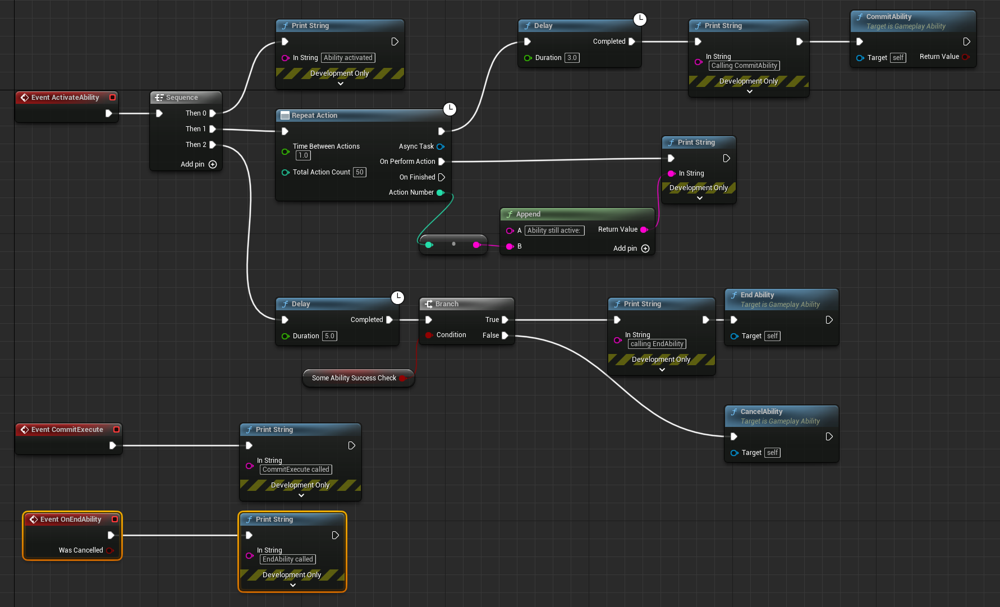

# Minimal Gameplay Ability System demo

GAS is a very powerful system in Unreal Engine, but it can be quite overwhelming to start with, and when I learnt it I couldn't find any small implementation example. So here it is!
___

We start with creating a ThirdPersonTemplate project.
In my repo I deleted the 'Content/Characters/Mannequin' assets to save space, we won't use animations here anyways.
Also I created a new 'Basic' map and removed the original ThirdPersonExample map with all its assets, to remove other unused assets and remain the example as minimal as possible

Activate "Gameplay Abilities" plugin in your plugin manager, restart the editor and we are ready to go.

First let's create our first gameplay ability (Content browser -> Gameplay -> Gameplay Ability blueprint, or Content browser -> Blueprint -> All classes -> GameplayAbility)

I will name it "GA_UselessAbility" (Prefix `GA_` for GameplayAbility, as in Lyra example and Tom Looman's guidelines)
For now let's just add a 'PrintString' node for `Event ActivateAbility`, our next task is to activate it.


All interactions with GameplayAbilitySystem are done via `AbilitySystemComponent` of some actor.
Any actor can have AbilitySystemComponent, but I've seen two nice examples:

Simplest way, which we will implement now, is when the Character has their own AbilitySystemComponent

LyraStarterGame has more complex solution:
- AbilitySystemComponent is attached to Player's `PlayerState`
- PlayerController has a getter for AbilitySystemComponent from their PlayerState
- When a Character is possessed, it receives a reference of AbilitySystemComponent from PlayerState (via LyraPawnExtensionComponent), and also has a getter for convenience
So all three (PlayerState, PlayerController, Character) have one single AbilitySystemComponent

> Also in LyraStarterGame the `GameState` has its own AbilitySystemComponent, which is used to fire global GameplayCues (useful in multiplayer), and for switching Game Phases (warmup, game, after game)

We are making a simple tutorial, so let's just open the character blueprint (BP_ThirdPersonCharacter) and add an AbilitySystemComponent to it.

Now, in BeginPlay, let's get `AbilitySystem` and call `TryActivateAbilityByClass` with our class (GA_UselessAbility). Nothing happens, because player (their AbilitySystemComponent) does not have this ability yet.

So, let's give this ability with `AbilitySystem->GiveAbility` with our GA_UselessAbility class and then `AbilitySystem->ActivateAbilityByClass`.
We have a message on screen, YAY, our first ability is working



You can activate abilities where you need, you can bind them to input or fire them inside other abilities
> There is also an integrated way to directly bind abilities to InputComponent, which are in detail described in [Tranek's documentation](https://github.com/tranek/GASDocumentation#concepts-ga-input).
There is still no official description how to bind GAS to EnhancedInput, though.

We will _traditionally_ bind our single ability to `Enter` directly in Character blueprint


Now we can actually make our ability useful.
> At first, I should notice that our ability is currently invalid. Comments in C++ (or when you hover ActivateAbility node) source say that we MUST call `CommitAbility` and `EndAbility` inside our ability blueprint
Until EndAbility is called, the ablity stays alive. We can check it by using `RepeatAction` node in ActivateAbility event. (see next image)

`CommitAbility` is the function that is intended to fire the ability execution. Maybe, before the ability actually executes, you have a 5-seconds long animation or whatever. Maybe when you use the ability, you need to have at least 69 mana, or 420 gold.
- It checks whether you have enough resources with CheckAbilityCost
(There is CostGameplayEffectClass in ability class defaults, or you can override it in CPP)
- It checks the ability cooldown (CooldownGameplayEffectClass)
- If both checks pass, it applies both (CommitAbilityCooldown, CommitAbilityCost), then calls CommitExecute, which you can override in blueprints

If you don't need this features, you can skip calling CommitAbility, or even call CommitAbilityCooldown and CommitAbilityCost manually, the ability still finishes correctly on EndAbility

Also, if something went wrong (Cooldown or Cost checks failed, or something else in blueprints) - you have an option to `CancelAbility`
After `EndAbility` or `CancelAbility`, will be called the `OnEndAbility` event, where you can do cleanup
Let's add some async nodes, so you can understand lifecycle

The output it will provide:
```
Ability activated
Ability still active: 0
Ability still active: 1
Ability still active: 2
Calling CommitAbility
CommitExecute called
Ability still active: 3
Ability still active: 4
EndAbility called
```

## Networking
This minimal demo works only in standalone mode. To make our AbilitySystemComponent working in multiplayer, we need to initialize it both on client and on server, for that we need to call `InitAbilityActorInfo(OnwerActor, AvatarActor)`, but in different places

It **MUST** be done in C++, so we need to move our component declaration there as well.
In our example I use Tranek's code snippets for initialization, you can find them here: https://github.com/tranek/GASDocumentation#412-setup-and-initialization

> In Lyra AbilitySystemComponent initialization order is a bit more complicated, but overall the same: we need to call `InitAbilityActorInfo`

Oh, and as we started to use GAS in C++, don't forget to add "GameplayAbilities" to PublicDependencyModuleNames inside your `.Build.cs` file

Here is the small code example of integration (not separated to `.h` and `.cpp` files for shortness)
```cpp
class AMinimalGASDemoCharacter : public AWhateverBaseCharacterClassYouWant, public IAbilitySystemInterface
{
	GENERATED_BODY()
public:
	AMinimalGASDemoCharacter()
	{
		AbilitySystemComponent = CreateDefaultSubobject<UAbilitySystemComponent>(TEXT("AbilitySystemComponent"));
		AbilitySystemComponent->SetIsReplicated(true);
	}

	UAbilitySystemComponent* AbilitySystemComponent;

	virtual UAbilitySystemComponent* GetAbilitySystemComponent() const override
	{
		return AbilitySystemComponent;
	}

	virtual void PossessedBy(AController* NewController) override
	{
		Super::PossessedBy(NewController);

		if (AbilitySystemComponent)
		{
			AbilitySystemComponent->InitAbilityActorInfo(this, this);
		}
		// ASC MixedMode replication requires that the ASC Owner's Owner be the Controller.
		SetOwner(NewController);
	}
};

class AMinimalGASDemoPlayerController : public APlayerController
{
	GENERATED_BODY()
public:
	virtual void AcknowledgePossession(APawn* P) override
	{
		Super::AcknowledgePossession(P);

		if (IAbilitySystemInterface* Character = Cast<IAbilitySystemInterface>(P))
		{
			Character->GetAbilitySystemComponent()->InitAbilityActorInfo(P, P);
		}
	}
};
```
Recompile cpp code, replace your blueprint 'AbilitySystemComponent' with CPP one, and we are good to go, you can activate abilities in multiplayer!


TODO:
- Basic GameplayCue demo
- Basic GameplayEffect demo
